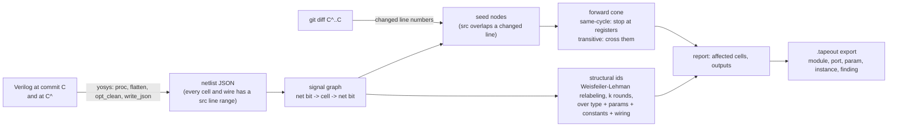

# rtl-impact

Change impact and node identity over RTL netlist graphs, with export to Tapeout Labs' `.tapeout` format.

Give it a Verilog design and a git commit. It tells you which logic the commit touched, what that logic feeds (same cycle and across clock cycles), which top-level outputs are affected, and, separately, which cells are structurally the same before and after the commit. That last number is the one that matters: it is the set of verification evidence that can survive a revision.


## Why

Tapeout Labs describes its core as a persistent graph of the chip program and names the open question: given revision N and N+1, which simulation, assertion, coverage and formal evidence from N can safely survive into N+1 ([tapeoutlabs.com/llms.txt](https://www.tapeoutlabs.com/llms.txt), "Research direction"). Answering that needs two things a text diff cannot give: what a change actually reaches in the logic, and whether a node after the change is the same node as before.

This tool is a small, honest version of both, measured on real commits.

## Results on PicoRV32

Design: [PicoRV32](https://github.com/YosysHQ/picorv32) at `ef203c2`, top `picorv32_axi`, default parameters, elaborated by Yosys 0.69 (`proc; flatten; opt_clean`). Full output in [`results/picorv32.json`](results/picorv32.json) and [`results/picorv32.tapeout`](results/picorv32.tapeout).

| Graph at head | |
|---|---|
| Cells (RTL-level operators, before gate mapping) | 919 |
| of which registers | 119 |
| Net bits | 5,109 |
| Edges | 14,718 |
| Combinational loops | 0 |

Real commits from the PicoRV32 history, each compared with its parent:

| Commit | Lines changed | Same-cycle cone | Transitive cone | Cells with unchanged structural identity |
|---|---|---|---|---|
| `6d145b7` Rename `decoded_imm_uj` to `decoded_imm_j` | 6 | 750 of 934 (80%) | 927 (99%) | **934 of 934** |
| `29102c0` Bugfix: decode fence instruction | 6 | 396 of 919 (43%) | 893 (97%) | 551 of 919 (368 changed) |
| `de92ce5` Fix RV32E shifts | 2 | 32 | 893 (97%) | 919 of 919 |
| `18cd609` Add rvfi_ixl (inside an `ifdef` that is off) | 2 | 0 | 0 | 934 of 934 |
| `258d63d` fix missed timer interrupts (2019) | skipped: that revision does not parse in Yosys 0.69 | | | |

What the rows mean:

- **The rename.** Line-based impact says 80% of the design changed. Structural identity says nothing changed. Every test result and coverage hit from before the rename should survive; a line-based system would discard all of it.
- **The real fix.** 368 cells get a new identity. Evidence attached to those is stale; the rest survives.
- **The configuration-dependent fix.** The RV32E change widens a signal from `[regindex_bits-1:0]` to `[4:0]`. With default parameters those are equal, so the elaborated design is identical and the tool correctly reports no change. Impact is per configuration.
- **The dead change.** The edit sits under an `ifdef` that is not compiled. Zero seeds, zero impact. A text tool would have rerun the regression.

Backward cones of outputs at head, for the same design:

| Output | Same-cycle cells | Transitive cells |
|---|---|---|
| `trap` | 1 | 773 (84%) |
| `mem_axi_awvalid` | 7 | 809 (88%) |
| `mem_axi_awaddr` | 1 | 790 (86%) |
| `pcpi_valid` | 1 | 2 |

Same-cycle cones are tiny because the outputs are registered; transitive cones show that on a CPU almost everything eventually influences everything, which is why transitive reach alone is not a rerun criterion and identity is needed.

## How it works



- **Graph.** Yosys's JSON gives cells (operators and registers after `proc`) and integer net-bit ids. Edges go input net to cell to output net. Registers are marked so cones can stop at them.
- **Seeds.** A commit's changed line numbers (new side of the unified diff) are matched against each cell's and wire's `src` range.
- **Cones.** Plain reachability, forward for impact, backward for fan-in, with an option to stop at registers.
- **Identity.** Each cell starts with a label made of its type, parameters and constant inputs. For k rounds the label absorbs the sorted labels of its neighbours through their port names. Names and line numbers are never part of the label, so renames and moves keep identity and logic changes within k hops break it. k defaults to 3.
- **Export.** The design and the findings are written as a `.tapeout` document (format version 1) and validated with the reference parser from [tapeout-labs/tof](https://github.com/tapeout-labs/tof) when it is installed.

## Install and run

```
brew install yosys                      # 0.69 tested
git clone https://github.com/owizdom/rtl-impact && cd rtl-impact
python3 -m venv .venv && . .venv/bin/activate
pip install -e ".[dev]"
pip install git+https://github.com/tapeout-labs/tof   # optional, validates the export
pytest
```

```
git clone https://github.com/YosysHQ/picorv32
rtl-impact stats    picorv32/picorv32.v --top picorv32_axi
rtl-impact cone     picorv32/picorv32.v --top picorv32_axi --port trap
rtl-impact impact   --repo picorv32 --file picorv32.v --top picorv32_axi --commit 6d145b7
rtl-impact identity --repo picorv32 --file picorv32.v --top picorv32_axi --commit 29102c0 --rounds 3
rtl-impact report   --repo picorv32 --file picorv32.v --top picorv32_axi \
    --commits 6d145b7 29102c0 de92ce5 18cd609 --json results/picorv32.json --tapeout results/picorv32.tapeout
```

The whole report on PicoRV32 takes about four seconds on a laptop.

## The export

The last lines of [`results/picorv32.tapeout`](results/picorv32.tapeout):

```
finding IMPACT-001 confirmed info "6d145b7 Rename decoded_imm_uj to decoded_imm_j" port eoi reasons line_overlap_seed,wl_structural_hash desc "6 changed lines seed 1225 nodes; same-cycle cone 750 cells, transitive 927 of 934; structural identity unchanged for 934 of 934 cells (k=3)" @ picorv32.v:640
finding IMPACT-002 confirmed warning "29102c0 Bugfix: decode fence instruction" port pcpi_insn reasons line_overlap_seed,wl_structural_hash desc "6 changed lines seed 333 nodes; same-cycle cone 396 cells, transitive 893 of 919; structural identity unchanged for 551 of 919 cells (k=3)" @ picorv32.v:651
```

Findings are `confirmed` because everything in them was computed by a deterministic tool from the files; nothing here is a model's guess. That follows the tier rule in the tof grammar.

## Tests

Seven tests on a three-stage pipeline in `tests/data/`: register count and no combinational loops; same-cycle cone smaller than transitive; changes inside an off `ifdef` produce no seeds and inside an on `ifdef` do; a rename keeps every structural id; a constant change breaks identity locally and not globally; an end-to-end run against a temporary git repository; and a well-formed export that the reference parser accepts.

## Limitations

- Cells are Yosys RTL operators after `proc`, not syntax-tree statements and not gates. A six-line edit inside a large `always` block seeds every cell that block produces, which over-counts same-cycle impact. Statement-level seeding from a SystemVerilog front end (slang) is the first thing to add.
- One elaborated configuration at a time. Pass `--define` for others; parameter overrides are not exposed yet.
- No test or coverage edges yet. The natural next step is per-test Verilator coverage, so that "affected cells" becomes "tests to rerun" and identity becomes "evidence that survives".
- Verilog only, through Yosys's built-in front end. SystemVerilog designs need a Yosys built with the slang frontend.
- The structural hash uses type, parameters, constant inputs and wiring; port widths are implicit in bit-level wiring.

## Design note

[`docs/design.md`](docs/design.md) is the longer proposal this tool is the first step of: schema with provenance and tiers, three-key identity, incremental ingestion, queries, and a scoring harness.

## License

MIT.
